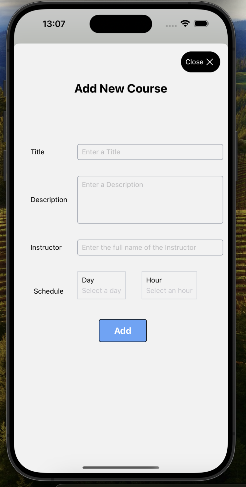
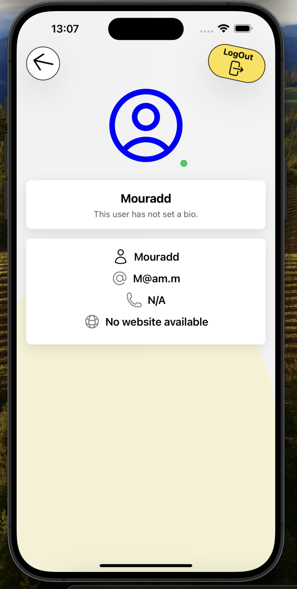
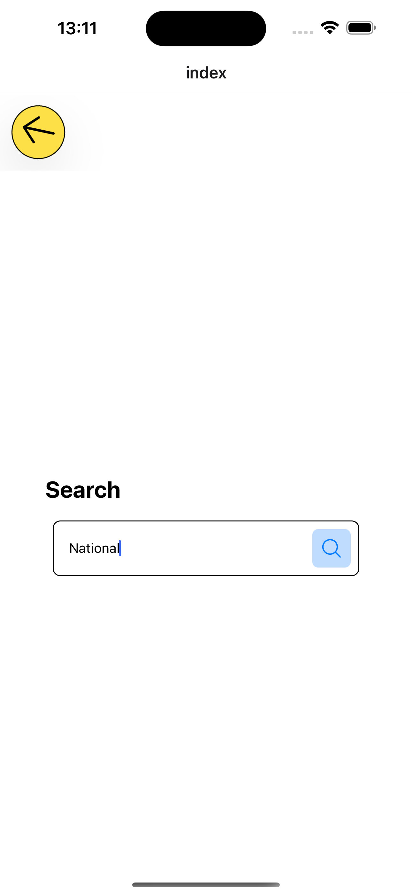
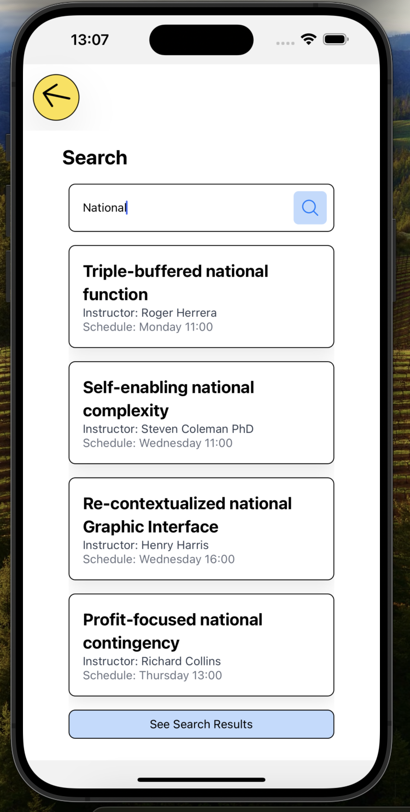
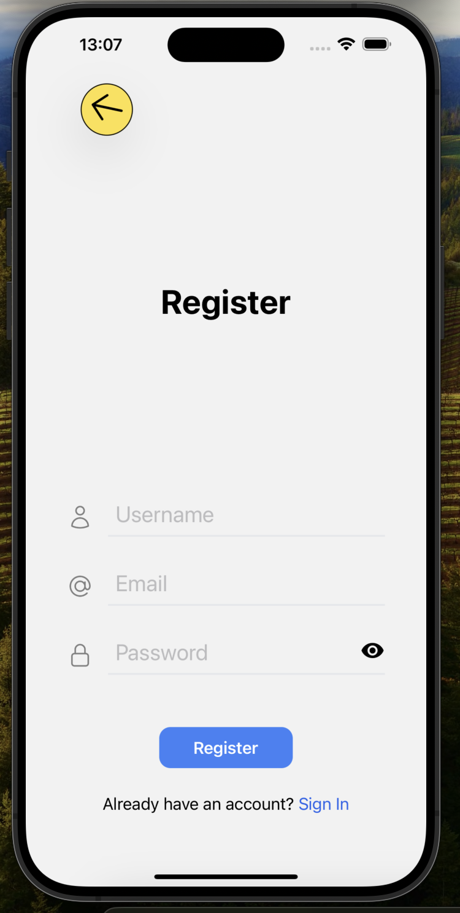
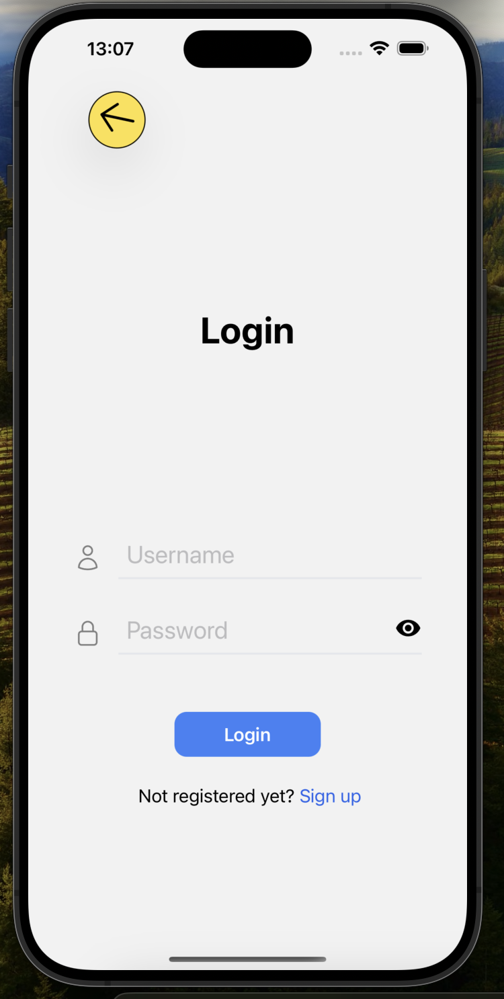

## Emeluators

```
XCode Simulator for ios
```
```
Android Studio Simulator for android
```

## Get started


1. for the front end, open a first terminal


   ```bash
   git clone git@github.com:mouradden/Course-Management-System-ReactNative.git
   ```

   ``` bash
   cd Course-Management-System-ReactNative
   ```

   ```bash
   npm i
   ```
2. for the back end, open a second terminal

   ```bash
    cd backend
   ```
   ```bash
    npm i
   ```
   ```bash
    npm start
   ```

## Technologies and libraries

TypeScript, React Native, Tailwind CSS, MongoDB, Expo, NestJS, and Axios.


## Some points in the features

1. Auth

Using NestJS, MongoDB, and bcrypt for secure user registration and login. The backend returns JSON responses with status codes for easy frontend handling, while Axios in React Native handles requests. Tokens are stored securely with Expo SecureStore to manage user sessions.

2. Getting data and pagination

Data retrieval and pagination using NestJS with MongoDB, allowing efficient loading of large datasets. The API handles requests by returning paginated results, ensuring smooth navigation for users. This improves performance and user experience by loading data in manageable chunks.

3. Search efficiency

Search efficiency by ensuring the input length exceeds three characters before querying. The system performs full-word matches to reduce unnecessary results and improve accuracy.

## Some Screens

<div style="display: grid; grid-template-columns: repeat(3, 1fr); gap: 10px;">
  <div style="width: 150px; height: 150px;">
    
  </div>
  <div style="width: 150px; height: 150px;">
    
  </div>
  <div style="width: 150px; height: 150px;">
    
  </div>
  <div style="width: 150px; height: 150px;">
    
  </div>
  <div style="width: 150px; height: 150px;">
    
  </div>
  <div style="width: 150px; height: 150px;">
    
  </div>
  <div style="width: 150px; height: 150px;">
    
  </div>
  <div style="width: 150px; height: 150px;">
    
  </div>
</div>
